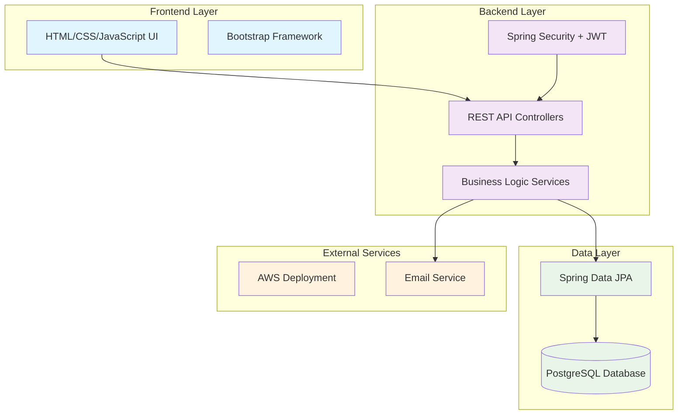
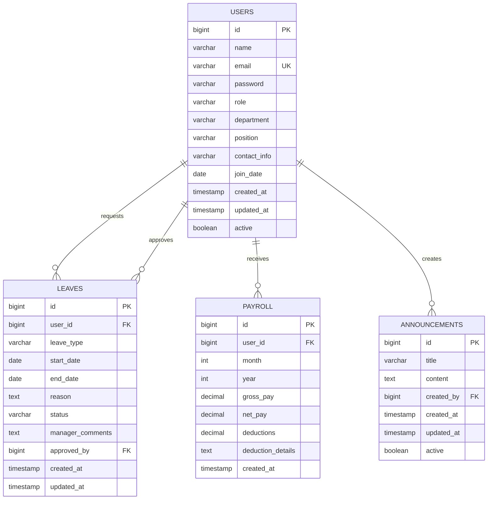

# Employee Portal Design Document

## Overview

The Employee Portal is a full-stack web application built with Spring Boot backend, PostgreSQL database, and a responsive frontend. The system implements a RESTful API architecture with JWT-based authentication and role-based access control. The application follows the MVC pattern with clear separation of concerns across presentation, business logic, and data access layers.

## Architecture

### High-Level Architecture



### Technology Stack

- **Backend Framework**: Spring Boot 3.x with Java 17
- **Database**: PostgreSQL 15+ with connection pooling
- **Authentication**: Spring Security with JWT tokens
- **Frontend**: HTML5, CSS3, JavaScript ES6+ with Bootstrap 5
- **Build Tool**: Maven with standard Spring Boot starter dependencies
- **Testing**: JUnit 5, Mockito, TestContainers for integration tests
- **Deployment**: Docker containers ready for AWS deployment

## Components and Interfaces

### 1. Authentication & Security Component

**Purpose**: Handle user authentication, authorization, and security concerns

**Key Classes**:
- `AuthController`: Login/logout endpoints
- `JwtAuthenticationFilter`: JWT token validation
- `UserDetailsServiceImpl`: Load user details for authentication
- `SecurityConfig`: Spring Security configuration

**API Endpoints**:
```
POST /api/auth/login
POST /api/auth/logout
POST /api/auth/refresh
```

**Security Features**:
- BCrypt password hashing
- JWT token generation and validation
- Role-based method security
- CORS configuration for frontend integration

### 2. User Management Component

**Purpose**: Manage employee profiles and user data

**Key Classes**:
- `UserController`: User CRUD operations
- `UserService`: Business logic for user management
- `UserRepository`: Data access for user entities
- `User`: Entity representing employee data

**API Endpoints**:
```
GET /api/users/profile
PUT /api/users/profile
GET /api/users (Admin only)
POST /api/users (Admin only)
PUT /api/users/{id} (Admin only)
DELETE /api/users/{id} (Admin only)
```

### 3. Leave Management Component

**Purpose**: Handle leave requests, approvals, and tracking

**Key Classes**:
- `LeaveController`: Leave request endpoints
- `LeaveService`: Leave business logic and approval workflow
- `LeaveRepository`: Data access for leave entities
- `Leave`: Entity representing leave requests

**API Endpoints**:
```
GET /api/leaves/my-requests
POST /api/leaves/request
GET /api/leaves/pending (Manager/Admin)
PUT /api/leaves/{id}/approve (Manager/Admin)
PUT /api/leaves/{id}/reject (Manager/Admin)
```

### 4. Payroll Component

**Purpose**: Provide access to payroll data and payslip generation

**Key Classes**:
- `PayrollController`: Payroll data endpoints
- `PayrollService`: Payroll business logic
- `PayrollRepository`: Data access for payroll entities
- `Payroll`: Entity representing payroll data

**API Endpoints**:
```
GET /api/payroll/my-payslips
GET /api/payroll/payslip/{id}
GET /api/payroll/payslip/{id}/download
```

### 5. Announcements Component

**Purpose**: Manage company-wide communications

**Key Classes**:
- `AnnouncementController`: Announcement endpoints
- `AnnouncementService`: Announcement business logic
- `AnnouncementRepository`: Data access for announcements
- `Announcement`: Entity representing announcements

**API Endpoints**:
```
GET /api/announcements
POST /api/announcements (Admin only)
PUT /api/announcements/{id} (Admin only)
DELETE /api/announcements/{id} (Admin only)
```

### 6. Admin Dashboard Component

**Purpose**: Provide administrative interface and metrics

**Key Classes**:
- `AdminController`: Admin dashboard endpoints
- `AdminService`: Administrative business logic
- `DashboardMetrics`: DTO for dashboard statistics

**API Endpoints**:
```
GET /api/admin/dashboard
GET /api/admin/users/stats
GET /api/admin/leaves/pending-count
```

## Data Models

### Database Schema



### Entity Relationships

- **User to Leave**: One-to-Many (user can have multiple leave requests)
- **User to Payroll**: One-to-Many (user has multiple payroll records)
- **User to Announcement**: One-to-Many (admin user creates multiple announcements)
- **Manager to Leave Approval**: One-to-Many (manager approves multiple leaves)

### Key Entity Attributes

**User Entity**:
- Unique email constraint for login
- Role enum: EMPLOYEE, MANAGER, ADMIN
- Soft delete with active flag
- Audit fields for creation and modification

**Leave Entity**:
- Status enum: PENDING, APPROVED, REJECTED
- Leave type enum: ANNUAL, SICK, PERSONAL, MATERNITY
- Date validation for logical start/end dates
- Manager comments for approval/rejection reasons

## Error Handling

### Exception Handling Strategy

**Global Exception Handler**: `@ControllerAdvice` class to handle all exceptions consistently

**Custom Exceptions**:
- `UserNotFoundException`: When user lookup fails
- `UnauthorizedAccessException`: When user lacks permissions
- `InvalidLeaveRequestException`: When leave request validation fails
- `PayrollAccessException`: When payroll access is denied

**Error Response Format**:
```json
{
  "timestamp": "2024-01-15T10:30:00Z",
  "status": 400,
  "error": "Bad Request",
  "message": "Leave end date must be after start date",
  "path": "/api/leaves/request"
}
```

### Validation Strategy

- **Bean Validation**: Use `@Valid` annotations with custom validators
- **Input Sanitization**: Sanitize all user inputs to prevent XSS
- **Business Rule Validation**: Service layer validation for complex business rules
- **Database Constraints**: Enforce data integrity at database level

## Testing Strategy

### Unit Testing

**Service Layer Tests**:
- Mock repository dependencies using Mockito
- Test business logic and validation rules
- Achieve 80%+ code coverage on service classes

**Controller Tests**:
- Use `@WebMvcTest` for isolated controller testing
- Mock service dependencies
- Test HTTP status codes and response formats

### Integration Testing

**Repository Tests**:
- Use `@DataJpaTest` with TestContainers PostgreSQL
- Test custom queries and database constraints
- Verify entity relationships and cascading

**End-to-End Tests**:
- Use `@SpringBootTest` with test database
- Test complete user workflows
- Verify security configurations

### Security Testing

**Authentication Tests**:
- Test JWT token generation and validation
- Verify role-based access control
- Test session timeout and token expiration

**Authorization Tests**:
- Verify endpoint access restrictions
- Test cross-user data access prevention
- Validate admin-only functionality

## Frontend Design

### Page Structure

**Layout Components**:
- Header with navigation and user menu
- Sidebar for main navigation (responsive collapse)
- Main content area with breadcrumbs
- Footer with company information

**Key Pages**:

1. **Login Page** (`/login`)
   - Simple form with email/password
   - Remember me checkbox
   - Forgot password link (placeholder)

2. **Dashboard** (`/dashboard`)
   - Welcome message with user name
   - Recent announcements widget
   - Quick stats (pending leaves, recent payslips)
   - Quick action buttons

3. **Profile Page** (`/profile`)
   - Editable form for personal information
   - Read-only fields for restricted data
   - Change password section

4. **Leave Management** (`/leaves`)
   - Leave request form
   - Leave history table with status
   - Calendar view of approved leaves

5. **Payroll** (`/payroll`)
   - Payslip list with download links
   - Monthly/yearly filtering
   - Summary statistics

6. **Admin Panel** (`/admin`)
   - User management table
   - Announcement creation form
   - Dashboard metrics and charts

### Frontend Architecture

**JavaScript Organization**:
- Modular ES6 classes for each page
- Shared utility functions for API calls
- Event-driven architecture for user interactions

**CSS Framework**:
- Bootstrap 5 for responsive design
- Custom CSS variables for theming
- Component-based styling approach

**API Integration**:
- Fetch API for HTTP requests
- JWT token management in localStorage
- Automatic token refresh handling
- Error handling with user-friendly messages

## Deployment Architecture

### Docker Configuration

**Multi-stage Dockerfile**:
- Build stage with Maven for compilation
- Runtime stage with OpenJDK 17 slim
- Environment variable configuration
- Health check endpoint

### AWS Deployment Options

**Option 1: Elastic Beanstalk**
- Simple deployment with managed infrastructure
- Auto-scaling and load balancing
- RDS PostgreSQL integration

**Option 2: ECS with Fargate**
- Container-based deployment
- Better resource utilization
- Integration with AWS services

### Environment Configuration

**Development Environment**:
- H2 in-memory database for quick testing
- Debug logging enabled
- Hot reload with Spring Boot DevTools

**Production Environment**:
- PostgreSQL RDS instance
- Connection pooling with HikariCP
- Structured logging with JSON format
- Health monitoring endpoints

## Security Considerations

### Authentication Security

- JWT tokens with 1-hour expiration
- Refresh token rotation
- Secure HTTP-only cookies for token storage
- Account lockout after failed attempts

### Data Protection

- Database encryption at rest
- TLS 1.3 for data in transit
- Input validation and output encoding
- SQL injection prevention with parameterized queries

### Access Control

- Role-based permissions at method level
- Resource-level authorization checks
- Audit logging for sensitive operations
- GDPR compliance for personal data handling

## Performance Considerations

### Database Optimization

- Proper indexing on frequently queried columns
- Connection pooling for database efficiency
- Lazy loading for entity relationships
- Database query optimization

### Caching Strategy

- Spring Cache abstraction for frequently accessed data
- Redis integration for distributed caching
- HTTP caching headers for static resources
- Application-level caching for user sessions

### Frontend Performance

- Minified and compressed static assets
- Lazy loading for non-critical JavaScript
- Responsive images with appropriate sizing
- Browser caching for static resources